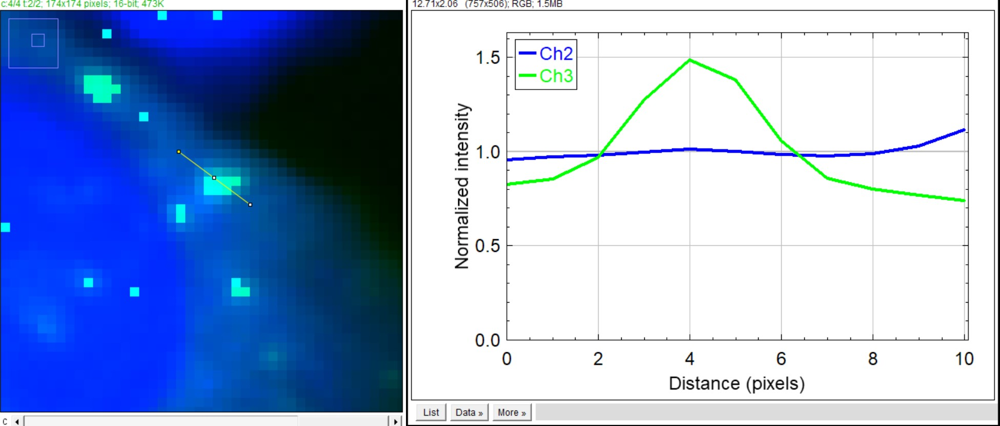

# Multi-channel Profile Plot (4 Modes)

이 매크로는 여러 채널의 line profile 을 한 번에 그려주면서,
**4가지 정규화/스케일링 모드** 중 하나를 선택해서 비교할 수 있는 통합 버전입니다.

이전의 non-scaled / scaled 버전을 모두 통합한 최종 버전입니다.

## 지원하는 4가지 모드

1. **Mean Normalization (Mean=1.0)**  
   - 각 채널의 평균을 1.0이 되도록 나누어 정규화합니다.  
   - 서로 다른 채널의 상대적인 패턴/형태 비교에 유리합니다.  
   - y축에는 `Normalized intensity` 가 표시되고, `y=1` 기준선을 회색으로 표시합니다.

2. **Max Scaling (Match Primary Ch Max)**  
   - 사용자가 제일 먼저 선택한 채널을 **기준 채널**로 삼습니다.  
   - 기준 채널의 최대값에 맞춰 다른 채널의 최대값을 동일하게 스케일링합니다.  
   - 최소값은 모두 0 근처로 가정하고, `Intensity (Max Scaled)` 로 표시됩니다.

3. **Min-Max Scaling (Match Primary Ch Min&Max)**  
   - 기준 채널의 **최소값과 최대값**을 모두 동일하게 맞추도록 선형 변환합니다.  
   - 각 채널 `y`에 대해  
     `scaled = (y - min) * (refRange / range) + refMin`  
     형태로 변환하여, 기준 채널과 동일한 범위에 정렬합니다.

4. **Raw Intensity (No Scaling)**  
   - 어떤 정규화도 하지 않고, 원래 intensity 값을 그대로 사용합니다.  
   - 범위 확인이 목적일 때, 또는 하나의 채널만 볼 때 사용하기 좋습니다.

## 사용 방법

1. 다채널 이미지를 ImageJ/Fiji에서 연 뒤, `Straight Line` 도구로  
   보고 싶은 위치에 선(Line ROI)을 그립니다.
2. 매크로 실행:  
   `Plugins > Macros > Run...` → `multichannel_plot.ijm` 선택
3. 나타나는 다이얼로그에서:
   - Plot에 포함할 채널들을 체크박스로 선택하고  
   - 아래의 **Normalization Method** 에서 4가지 모드 중 하나를 선택합니다.  
     (여러 채널을 선택했을 때, 가장 먼저 체크된 채널이 기준 채널이 됩니다.)
4. `OK` 를 누르면 각 채널 색(LUT)에 맞춰 선이 그려지고,  
   선택한 모드에 따라 스케일링된 line profile plot 이 생성됩니다.

## 스타일 특성 (논문용 플롯)

- 폰트 크기: 24 pt
- 선 두께: 4 px
- x축: `Distance (단위)` (픽셀 크기/voxel size 를 반영한 실제 거리)
- y축: 선택한 모드에 따라 다른 제목(`Normalized intensity`, `Intensity (Max Scaled)` 등)

## 예시 스크린샷

## 매크로 다운로드

- [Download macro (.ijm)](assets/macros/multichannel_plot.ijm)

이 매크로를 기준으로 필요한 경우 일부 로직(예: 특정 채널만 강제로 사용,  
범위를 고정 등)을 수정해, 본인 실험에 맞는 변형 버전을 만들 수 있습니다.

