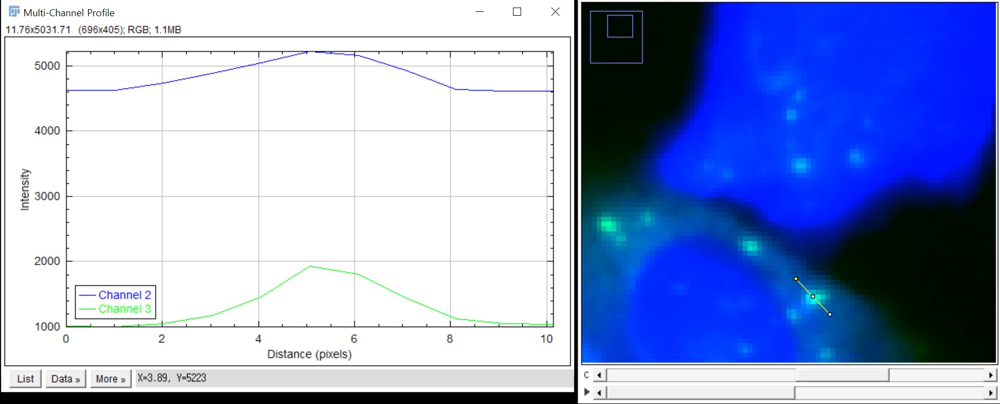

# Multi-Channel Line Profile (Non-scaled)

이 매크로는 Composite 이미지에서 선택한 **Straight Line ROI**를 기준으로
각 채널의 intensity profile 을 한 그래프 안에 그려줍니다.

## 기능 요약

- 여러 채널의 intensity profile 을 한 번에 계산
- LUT 색상(red, green, blue, magenta, cyan, yellow, lightGray)에 따라 plot 색 자동 설정
- 사용자가 체크박스로 그릴 채널 선택
- 모든 선택된 채널의 최소/최대값을 사용해 Y축 자동 스케일링
- 선택 시 Results Table 로 수치 데이터 내보내기 가능

## 사용 방법

1. 다채널 이미지를 ImageJ/Fiji에서 연 뒤, Composite 모드인지 확인합니다.  
   (24-bit RGB 이면 매크로에서 자동으로 Composite 로 변환합니다.)
2. `Straight Line` 도구로 intensity를 보고 싶은 위치에 선을 그립니다.
3. 매크로를 실행합니다:  
   `Plugins > Macros > Run...` 에서 `non-scaled_multichannel_plot.ijm` 선택
4. 나타나는 다이얼로그에서 plot 에 포함할 채널과
   결과 테이블(Results Table)에 데이터를 내보낼지 여부를 선택합니다.

## 결과 예시

## 매크로 다운로드

- [Download macro (.ijm)](assets/macros/non-scaled_multichannel_plot.ijm)

