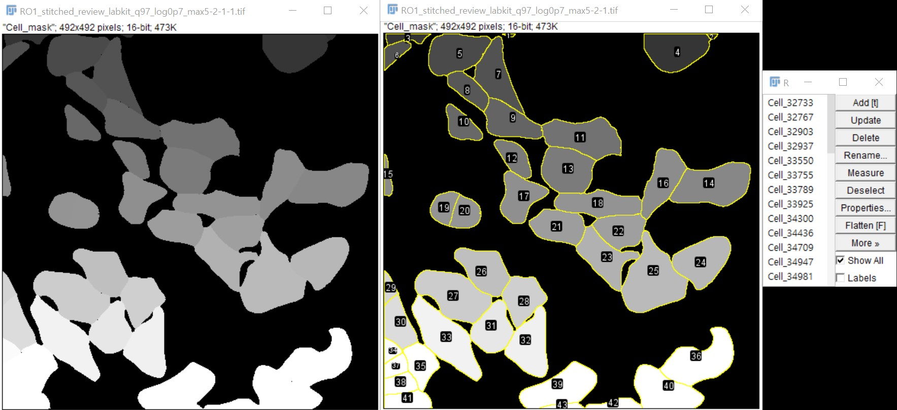

# ROI Detection from Mask (Label Map → ROI)

이 매크로는 **각 픽셀 값(밝기 값)을 개별 세포 ID로 간주**하고,
해당 ID가 존재하는 값마다 하나의 ROI를 자동으로 생성해
ROI Manager에 넣어주는 도구입니다.

즉, 라벨 마스크(label map) 이미지에서 **셀 ID → ROI** 변환을 자동으로 해 줍니다.

## 매크로 동작 개요

- 현재 활성 이미지의 히스토그램을 계산하여, 실제로 등장하는 intensity 값만 검사합니다.
- 0은 배경으로 간주하고 건너뜁니다.
- 각 값 `i`에 대해:
  - Threshold 를 `[i, i]`로 설정
  - `Create Selection` 으로 선택 영역 생성
  - ROI Manager 에 추가하고 이름을 `Cell_i` 로 지정
- 마지막에 `Show All with labels` 로 모든 ROI를 라벨과 함께 표시합니다.

## 사용 방법

1. 각 세포/객체가 서로 다른 픽셀 값(예: 1, 2, 3, …)을 갖는 **라벨 마스크 이미지**를 준비합니다.  
   - 8-bit (최대 256 ID) 또는 16-bit (최대 65536 ID)를 지원합니다.
2. 해당 이미지를 ImageJ/Fiji에서 연 뒤, 이 매크로를 실행합니다.  
   - `Plugins > Macros > Run...` → `ROIdetectionFromMask.ijm` 선택
3. 매크로가 모든 ID에 대해 ROI를 만들고, ROI Manager 에 `Cell_번호` 형식으로 추가합니다.
4. 완료 후 ROI Manager에서 원하는 ROI를 선택해 측정/저장/수정할 수 있습니다.

## 예시 스크린샷



## ROI 선을 이미지에 새겨 넣기 (Burn-in)

ROI Manager 에서 ROI를 얻은 뒤, **ROI 선 자체를 이미지 위에 굽혀서 저장**하고 싶다면
`Flatten` 기능을 사용합니다.

### 방법 1: 메뉴를 이용한 수동 저장

1. ROI가 실제 이미지 위에 보이도록 설정합니다.  
   - ROI Manager가 열려 있고 선이 안 보이면, `Show All` 을 체크하세요.
2. 상단 메뉴에서 `Image > Overlay > Flatten` 을 선택합니다.  
   - 단축키: `Ctrl + Shift + F`
3. 새로운 이미지 창이 뜹니다.  
   - 이 이미지는 RGB로 변환되어 있고, 노란색(또는 설정한 색)의 ROI 선이 **픽셀 자체에 새겨진 상태**입니다.
4. 이제 이 이미지를 `File > Save As...` 로 원하는 포맷(PNG, TIFF 등)으로 저장하면 됩니다.

### 방법 2: 매크로에서 Flatten + 저장

Flatten 과 저장을 자주 반복한다면, 간단한 매크로로 자동화할 수도 있습니다.

```javascript
// 현재 이미지 + 현재 ROI를 Flatten 해서 새 이미지로 저장
run("Flatten");
saveAs("TIFF", "/path/to/output_flattened.tif"); // 경로를 원하는 위치로 변경
```

위 매크로를 응용해서 파일 이름을 자동으로 붙이거나,
여러 이미지를 반복 처리하는 스크립트로 확장할 수 있습니다.

## 매크로 다운로드

- [Download macro (.ijm)](assets/macros/ROIdetectionFromMask.ijm)

