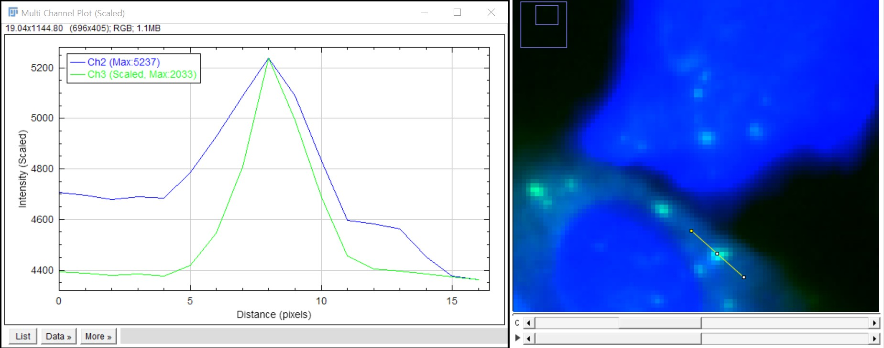

# Multi-Channel Line Profile (Scaled)

이 매크로는 각 채널의 intensity 범위를 **첫 번째 기준 채널에 맞춰 정규화**하여,
신호가 약한 채널과 강한 채널을 한 그래프에서 비교하기 쉽게 만들어 줍니다.

## 기능 요약

- Line selection 기반 multi-channel intensity profile 계산
- 첫 번째로 선택한 채널을 **reference 채널**로 사용
- 나머지 채널은 reference 채널의 min/max 범위에 맞게 선형 스케일링
- 채널별 최대값 정보를 legend 에 표시 (예: `Ch2 (Scaled, Max: 1234)`)

## 사용 방법

1. 다채널 이미지를 연 뒤, `Straight Line` 도구로 프로파일을 보고 싶은 위치에 선을 그립니다.
2. 매크로를 실행합니다:  
   `Plugins > Macros > Run...` 에서 `scaled_multichannel_plot.ijm` 선택
3. 채널 선택 다이얼로그에서
   - **가장 먼저 체크한 채널**이 Y축 스케일의 기준(reference)이 됩니다.
   - 나머지 채널은 이 기준 범위에 맞춰 스케일링되어 표시됩니다.

## 결과 예시

## 매크로 다운로드

- [Download macro (.ijm)](assets/macros/scaled_multichannel_plot.ijm)

기준 채널을 바꿔가며 실행하면, 서로 다른 채널 간의 상대적인 강도 차이를 더 직관적으로 비교할 수 있습니다.

